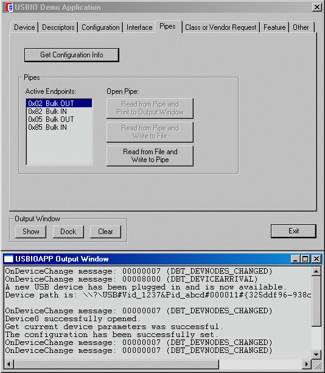

## USB Bulk device and TNKernel

## Description

 The TNKernel USB bulk firmware is the USB bulk device driver for TNKernel real-time OS. Current version of the USB bulk firmware supports Philips LPC214x ARM-based microcontrollers.

 There are two main groups of operations in USB bulk firmware - support USB Control (Endpoint 0) and support of the bulk data transfer -reception & transmission.

**1\. Endpoint 0 Control Requests Processing**

  The control transfers processing (Chapter 9 of the USB specification) is a mostly independent of the hardware (see the file _tn_usb_req.c_).
  The TNKernel USB firmware supports the 9 required requests. The SYNCH_FRAME and SET_DESCRIPTOR requests are not supported (these requests put the device to the forced stall condition)

<table cellpadding="0" cellspacing="0" border="0" id="table" class="sortable">

<tbody>

<tr>

<td bgcolor="#F0F0F0" class="style4" align="center" valign="top" width="157">

Request

</td>

<td bgcolor="#F0F0F0" class="style4" align="center" valign="top" width="165">Direction for Data Stage</td>

<td bgcolor="#F0F0F0" class="style4" align="center" valign="top" width="390">

Description of host request

</td>

</tr>

<tr>

<td class="style4" height="16" valign="top" width="157">GET_CONFIGURATION</td>

<td class="style4" align="center" height="16" valign="top" width="165">IN</td>

<td class="style4" height="16" valign="top" width="390"> The current device configuration number.
Device responds during the data stage with a one byte info which configuration was last selected.</td>

</tr>

<tr>

<td class="style4" valign="top" width="157">GET_STATUS</td>

<td class="style4" align="center" valign="top" width="165">IN</td>

<td class="style4" valign="top" width="390"> The current status of the device, an interface, or an endpoint. The device responds during the data stage with a two bytes, that contains a requested status.</td>

</tr>

<tr>

<td class="style4" height="30" valign="top" width="157">GET_DESCRIPTOR</td>

<td class="style4" align="center" height="30" valign="top" width="165">IN</td>

<td class="style4" height="30" valign="top" width="390"> A descriptor. The device responds during
the data stage with the requested descriptor data. If the request is for a configuration descriptor, all interface and endpoint descriptors associated with that configuration are returned (up to the amount of data requested by the host).</td>

</tr>

<tr>

<td class="style4" valign="top" width="157">GET_INTERFACE</td>

<td class="style4" align="center" valign="top" width="165">IN</td>

<td class="style4" valign="top" width="390"> The currently selected alternate for a given interface. The device responds with the alternate number of the currently selected alternate interface.</td>

</tr>

<tr>

<td class="style4" valign="top" width="157">SET_ADDRESS</td>

<td class="style4" align="center" valign="top" width="165">no data stage</td>

<td class="style4" valign="top" width="390"> Set the address contained in the request. The device updates its address to reflect the new address after the status stage of this request.</td>

</tr>

<tr>

<td class="style4" valign="top" width="157">SET_CONFIGURATION</td>

<td class="style4" align="center" valign="top" width="165">no data stage</td>

<td class="style4" valign="top" width="390"> Set a device configuration.</td>

</tr>

<tr>

<td class="style4" valign="top" width="157">SET_INTERFACE</td>

<td class="style4" align="center" valign="top" width="165">no data stage</td>

<td class="style4" valign="top" width="390"> An alternate interface for the selected interface number.</td>

</tr>

<tr>

<td class="style4" valign="top" width="157">SET_DESCRIPTOR</td>

<td class="style4" align="center" valign="top" width="165">OUT</td>

<td class="style4" valign="top" width="390"> This request is optional and is not supported by the TNKernel USB bulk firmware.</td>

</tr>

<tr>

<td class="style4" valign="top" width="157">SET_FEATURE</td>

<td class="style4" align="center" valign="top" width="165">no data stage</td>

<td class="style4" valign="top" width="390"> Request to enable a device feature (remote wakeup) or an endpoint feature (endpoint halt).</td>

</tr>

<tr>

<td class="style4" valign="top" width="157">CLEAR_FEATURE</td>

<td class="style4" align="center" valign="top" width="165">no data stage</td>

<td class="style4" valign="top" width="390"> Request to disable a device feature (remote wakeup) or an endpoint feature (endpoint halt).</td>

</tr>

<tr>

<td class="style4" valign="top" width="157">SYNCH_FRAME</td>

<td class="style4" align="center" valign="top" width="165">IN</td>

<td class="style4" valign="top" width="390"> This request is optional and it is not supported by the TNKernel USB bulk firmware.</td>

</tr>

</tbody>

</table>

**2\. Bulk Endpoints Transfer processing**

  The USB is a block device and to reach maximal bulk data transfer rate, the data have to be transferred by the 64-byte packets. The TNKernel USB bulk firmware uses a fixed size 64-bytes packets only. For the variable length data, you can use any of a well-known technologies for a block device drivers.

**2.1 Transfer without DMA (Philips LPC214x)**

  The each endpoint has an associated data queue and a fixed-sized memory pool with the own task for the operations.

   For the IN endpoints (transmission) the each data queue's entry contains a pointer to the memory block (64 bytes) with the data to transmit. A memory blocks are managed by the fixed-sized memory pool.
   An each IN token causes a hardware interrupt. Inside the interrupt handler, if the data queue's is not empty (there are data to transmit) then the data is entered into the hardware transmitter and a memory block is released. Otherwise, there are no a data for the writing to the transmitter and the hardware automatically sends the NAK answer to the host.

   For the OUT endpoints (reception) the each data queue's entry contains a pointer to the empty memory block (64 bytes) to store receiving data. A memory blocks are managed by the fixed-sized memory pool.
   The each OUT request causes hardware interrupt. In the interrupt handler, if there is a free memory block for the reception, then the firmware reads a data from the hardware receiver to the memory block. A pointer to the memory block is sent into the data queue.
   The reception task waits the data from the receiver data queue by the TNKernel _tn_queue_receive()_ function.

    **2.2 Transfer with DMA (Philips LPC2146/8)**

  The each endpoint has an associated data queue and a fixed-sized memory pool with the own task for the operations.

   For the IN endpoints (transmission) the each data queue's entry contains a pointer to the memory block (64 bytes) with the data to transmit. A memory blocks are managed by the fixed-sized memory pool.

   There are two DMA interrupts for each IN transaction:

    - _end_of_transfer_ - transmission of data block is finished 
    - _DD_request (descriptor_request)_ - new DMA memory block should be set for transmission.

   In the transmission's interrupt handler _end_of_transfer_ , the firmware just clears an interrupt flag for the normal hardware operations.
   In the transmission's interrupt handler _DD_request (descriptor_request)_ , the firmware checks a data queue. If a data queue is not empty (there are data to transmit), the firmware selects a new DMA memory block for the transmission and copies data from the queue's memory block to the DMA memory. A queue's memory block is released.
   If the data queue is empty (there are no data to transmit), the firmware sets as active a special DMA memory block with the _no_packet_ parameters. When the DMA engine makes a processing for the block, it sends the NAK answer to the host.

   For the OUT endpoints (reception) the each data queue's entry contains a pointer to the empty memory block (64 bytes) to store receiving data. A memory blocks are managed by the fixed-sized memory pool.

   There are two DMA interrupts for each OUT request:

     - _end_of_transfer_ - data is ready in DMA memory 
     - _DD_request (descriptor_request)_ - new DMA memory block should be set for receiver

   In the reception's _end_of_transfer_ interrupt handler, the firmware gets a free memory block from the fixed-sized memory pool and the data is copied to this memory block from the DMA memory. A pointer to the memory block is sent into the receiver's data queue.
   The reception task waits the data from the receiver's data queue by the TNKernel  _tn_queue_receive()_ function.
   When a data arrives, a reception task makes the user data processing. Then a memory block is released and the DMA interrupt (actually, data reception) is enabled for this endpoint. Until a DMA endpoint interrupt is disabled, the hardware automatically sends the NAK answer to the host for each OUT request.
   In the reception's _DD_request_ interrupt handler, the firmware checks a free memory block availability in the fixed-sized memory pool. If there is no free memory block, a DMA interrupt is not enabled (it means the NAK answer to host).  If there is free memory block, the firmware sets a new DMA memory block for the reception and enables a DMA endpoint interrupt (the data reception).

**3\. USB  VID and PID**

  For the TNKernel USB bulk firmware tests, a dummy VID = 1237(hex) & PID = ABCD(hex) are used (see the file _tn_usb_descr.c_).

**4\. PC USB driver and test software**   

  The TNkernel USB has been tested with the USBIO - USB host driver for Windows from Thesycon(r)
  ([http://www.thesycon.de](http://www.thesycon.de/)). 
   The demo version of the driver can be used for 4 hours. Then all function calls will be rejected and the computer must be rebooted in order to use the demo again.
   A free USBIO Development Kit Demo includes Installation Wizard, USBIO Cleanup Wizard and a test application (it is used for all TNKernel USB tests).

**5\. PC USB driver installation**

    **5.1** Install a demo version of USBIO – USB Development Kit for Windows *.exe file from Thesycon(r)
     ([http://www.thesycon.de](http://www.thesycon.de/))

    **5.2** Load the test firmware into the Philips LPC2146/48 FLASH - either with or without DMA

    **5.3** Open the Windows Device Manager (_Control Panel -> System -> Hardware -> Device Manager_ or  _Start Menu -> Run_ and then type '_devmgmt.msc_'

    **5.4** Connect an USB cable from the PC to the development board
  A message '_Found New Hardware TNKernel USB_' in the desktop tray should appear and in the Windows Device Manager's list the new record '_Other devices -> TNKernel USB_' should be added.
   Close a Windows Driver Installation Wizard window (Windows invokes it automatically). It is not used here.

    **5.5** From an USBIO installation directory, run the USBIO's own Installation Wizard  - USBIOwiz.exe
   Select the device '>>Unknown_<< | TNKernel USB' from the list and press a button 'Next'.
   After the finishing of the process, in the Windows Device Manager's list you shell see a record 'USBIO controlled devices - > USBIO Device VID=1237 PID=ABCD'.
   Close the USBIO Installation Wizard application.

**6\. TNkernel USB bulk firmware tests**

   There are two sets of the base test firmware:

    - in the firmware's directory 'LPC2146'     - a test application without DMA. 
    - in the firmware's directory 'LPC2146_DMA' - a test application with DMA.

   The test firmware creates a 2 bidirectional bulk pipes by the LPC214x's USB Endpoint 2 and Endpoint 5.
   An each physical endpoint has the own task to operate.

**6.1 Preparation of the tests**

       **6.1.1** Load the test firmware into the Philips LPC2146/48 FLASH;

       **6.1.2** From the USBIO installation directory, run the USBIO test application (it is used for all TNKernel USB firmware tests) - USBIOAPP.EXE.
  In the main window on the page '_Device_', select in the listbox '_Available Devices_' device's entry (for the single USBIO device, it will be the entry '_Device 0_')  and press a button '_Open_'. Check all operations results by the messages in the  '_USBIOAPP Output Window_'.
  On the page '_Configuration_' press a button '_Set Configuration_'. the LED on Test Board should stop flickering.
  On the page '_Pipes_', the all four firmware endpoints have to be in the listbox '_Active Endpoints_'.

**6.2 Test N 1 - Checking speed of 'PC to USB device'  data stream**

  In the firmware test N1, the Endpoint 5 RX (Bulk OUT Pipe 0x05) receives the data from the PC.

  In the main window on the page '_Pipes_', in the listbox '_Pipes_' select the '_0x05 Bulk OUT_' and press a button '_Read from File and Write to Pipe_' - a new dialog window is opened.  
  In the dialog window '_USBIOAPP - Bulk OUT Pipe 0x05_' open the page '_Buffers_' and set '_Size of Buffers_' - 4096, '_Number of Buffers_'- 4.
  On the page '_Write from File to Pipe_' choose a source file (any, but it is recommended to use a file with size of few megabytes) and press a button '_Start Writing_'. 
  After a few seconds of transmission, the value of a transfer speed in the editbox '_Mean data rate_' will be stable.

**6.3 Test N 2 - Checking speed of 'USB device to PC' data stream**

  In the firmware test N2, the Endpoint 2 TX (Bulk IN Pipe 0x82) sends a data in the text format by the 64-byte packets.

  In the main window on the page '_Pipes_', in the listbox '_Pipes_' select the entry '_0x82 Bulk IN_' and press a button '_Read from Pipe and Write to File_' - a new dialog window is opened.
  In the dialog window '_USBIOAPP - Bulk IN Pipe 0x82_' open the page '_Buffers_' and set '_Size of Buffers_' - 4096, '_Number of Buffers_'- 4.
  On the page '_Read from Pipe to File_' choose a destination file and press a button '_Start Reading_'. 
  In the editbox '_Mean data rate_' you shell see the transfer speed value. Do not stop a reading immediately because the measurement takes a few seconds.

  You can check a destination data file's contents with any text viewer/editor. An each text line in the file starts with the 12-digit ASCII  number and has following spaces up to the line end. A total line length is 64 bytes  - 62 bytes of the text + 2 bytes for the '\r\n'.The   ASCII numbers must be in the '+1' sequence from line to line without dropping.

**       6.4 Test N 3 - Checking speed of loop-back data transfer**

  In the firmware test N3, the Endpoint 2 (Bulk OUT pipe 0x02) and the Endpoint 5  (Bulk IN pipe 0x85) are used for the loop-back data transferring - the data, that the Endpoint 2 RX receives from the PC,  are sent to the Endpoint 5 TX for the transmission back to the PC (in the firmware, there is a separate data queue for  this purpose).

  In the main window on the page '_Pipes_', in the listbox '_Pipes_' select the entry '_0x02 Bulk OUT_'  and press a button '_Read from File and Write to Pipe_' - a new dialog window is opened.
  In the main window on the page '_Pipes_', in the listbox '_Pipes_' select the entry '_0x85 Bulk IN_'  and press a button '_Read from Pipe and Write to File_' - a new dialog window is opened.
  In the both dialog windows open the page '_Buffers_' and set '_Size of Buffers_' - 4096, '_Number of Buffers_'- 4.
  In the dialog window '_USBIOAPP - Bulk IN Pipe 0x85_', on the page '_Read from Pipe to File_' choose a destination file.
  In the dialog window '_USBIOAPP - Bulk OUT Pipe 0x05_', on the page '_Write from File to Pipe_'  choose a source file (any, but it is recommended to use a file with size of few megabytes ).
  Uncheck the checkbox '_Rewind at and of file_'.
  Press a button '_Start Reading_'.
  Press a button '_Start Writing_'.
  After finishing of the transfer, press a button '_Stop reading_'  (the writing is terminated automatically).
  You can compare both files (the source and the destination) - they must have the same length and contents.

**7. Data transfer performance tests**

**7.1 Environment:**

<table cellpadding="0" cellspacing="0" border="0" id="table1" class="sortable">

<tbody>

<tr>

<td bgcolor="#F0F0F0" width="108">Host computer:</td>

<td>Pentium(R) 4 CPU 1.60 GHz, 256Mb RAM Intel(r), 82801 BA/BAM USB Universal Host Controller, Windows XP Pro SP2</td>

</tr>

<tr>

<td bgcolor="#F0F0F0" valign="top" width="108">Host USB driver:</td>

<td>Thesycon(r) USBIO.SYS v.2.31 Demo version</td>

</tr>

<tr>

<td bgcolor="#F0F0F0" width="108">Host application:</td>

<td>USBIOAPP.EXE by Thesycon(r); Buffers size - 4096 Number of buffers - 4</td>

</tr>

<tr>

<td bgcolor="#F0F0F0" width="108">Device:</td>

<td>Philips LPC 2146 (Fcore = 60MHz, Fusb = 48MHz)</td>

</tr>

</tbody>

</table>

       **7.2 Raw data transfer** (no OS, just send/receive dummy data)

<table cellpadding="0" cellspacing="0" border="0" id="table2" class="sortable">

<tbody>

<tr>

<td bgcolor="#F0F0F0" colspan="2" align="center">Speed for both direction (PC to device, device to PC) - KBytes/sec</td>

</tr>

<tr>

<td align="center" width="46%">Without DMA</td>

<td align="center" width="47%">1132</td>

</tr>

<tr>

<td align="center" width="46%">With DMA</td>

<td align="center" width="47%">1136</td>

</tr>

</tbody>

</table>

       **7.3 TNkernel USB bulk firmware examples** (with TNKernel v.2.1)

        Firmware tests:   usb_test1 (without DMA); usb_test2 (with DMA)

<table cellpadding="0" cellspacing="0" border="0" id="table3" class="sortable">

<tbody>

<tr>

<td bgcolor="#F0F0F0" colspan="5" class="style4" align="center">TNkernel USB bulk firmware examples - data transfer speed (in KBytes/sec)</td>

</tr>

<tr>

<td bgcolor="#F0F0F0" rowspan="3" align="center" valign="top" width="235">Test</td>

<td bgcolor="#F0F0F0" rowspan="3" align="center" valign="top" width="235">PC to device</td>

<td bgcolor="#F0F0F0" rowspan="3" align="center" valign="top" width="235">Device to PC</td>

</tr>

<tr>

<td bgcolor="#F0F0F0" colspan="2" align="center" valign="top" width="612">Loop-back</td>

</tr>

<tr>

<td bgcolor="#F0F0F0" align="center" valign="top" width="306">PC to device</td>

<td bgcolor="#F0F0F0" align="center" valign="top" width="306">Device to PC</td>

</tr>

<tr>

<td rowspan="2" align="center" valign="top" width="235">With DMA</td>

<td rowspan="2" align="center" valign="top" width="235">1083</td>

<td rowspan="2" align="center" valign="top" width="235">1083</td>

<td align="center" valign="top" width="306">565</td>

<td align="center" valign="top" width="306">565</td>

</tr>

<tr>

<td colspan="2" align="center" valign="top">Total: 1130</td>

</tr>

<tr>

<td rowspan="2" align="center" valign="top" width="235">Without DMA</td>

<td rowspan="2" align="center" valign="top" width="235">1048</td>

<td rowspan="2" align="center" valign="top" width="235">753</td>

<td align="center" valign="top" width="306">565</td>

<td align="center" valign="top" width="306">565</td>

</tr>

<tr>

<td colspan="2" align="center" valign="top">Total: 1130</td>

</tr>

</tbody>

</table>

## License

<table cellpadding="0" cellspacing="0" border="0" id="table_1" class="sortable">

<tbody>

<tr>

<td>BSD</td>
</tr>

</tbody>

</table>

© 2005, 2017 **Yuri Tiomkin**

